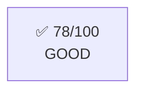
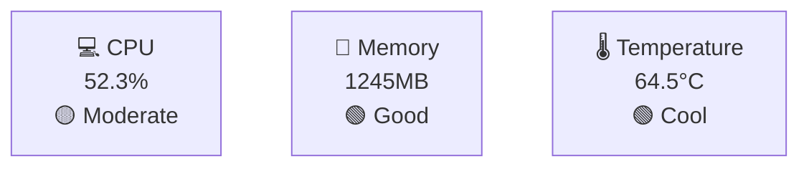

# 🎯 Enhanced Performance Reporting - Complete Guide

## What's New? ✨

Your performance reports now include **visual scoring system** that tells you **instantly if your model is good or not**!

### 🌟 Key Features

#### 1. Overall Performance Score (0-100)
Every report starts with a **clear grade**:
- ⭐ **90-100**: EXCELLENT 
- 🟢 **80-89**: VERY GOOD
- ✅ **70-79**: GOOD
- 🟡 **60-69**: ACCEPTABLE
- ⚠️ **50-59**: NEEDS IMPROVEMENT
- ❌ **<50**: POOR

**Visual color-coded box** shows your score immediately!



#### 2. Status Indicators for Every Metric

Each metric has a **color-coded status**:
- 🟢 **Excellent** / Good / Cool / Low
- 🟡 **Acceptable** / Moderate / Warm
- 🟠 **High** / Hot
- 🔴 **Too Slow** / Critical / Dangerous

**Example:**
```
| STT Latency | 245ms | 🟡 Acceptable |
| LLM Latency | 1890ms | 🟡 Acceptable |
| CPU Usage | 52.3% | 🟡 Moderate |
| Temperature | 64.5°C | 🟢 Cool |
```

#### 3. Target vs Actual Charts

**See instantly if you're meeting targets!**

```mermaid
xychart-beta
    title "Latency: Target vs Actual"
    x-axis [STT, LLM, TTS, Total]
    bar "Target" [200, 1500, 150, 2000]
    bar "Actual" [245, 1890, 205, 2340]
```



Compare your actual performance against ideal targets!

#### 4. System Health Overview

**At-a-glance system status:**



Green = Good, Yellow = Watch, Red = Problem!

#### 5. Actionable Recommendations

**Specific advice on what to improve:**

```
🟡 Latency: Total response time could be improved (>2340ms)
   - LLM is the bottleneck - consider model optimization
   - Check system load during conversations

🟠 LLM Performance: Language model inference is slow (>1890ms)
   - This is expected on RPi 4 with Qwen2.5:0.5B
   - Consider: RPi 5, or cloud-based LLM (OpenAI API)

🔴 THERMAL: Temperature is critical (85°C)
   - **URGENT:** Add cooling solution (heatsink + fan)
   - Thermal throttling is likely reducing performance
```

## Performance Thresholds 📏

### Latency Targets
| Component | 🟢 Excellent | 🟡 Acceptable | 🔴 Too Slow |
|-----------|-------------|---------------|-------------|
| **STT** | < 200ms | 200-300ms | > 300ms |
| **LLM** | < 1500ms | 1500-2000ms | > 2000ms |
| **TTS** | < 150ms | 150-250ms | > 250ms |
| **Total** | < 2000ms | 2000-3000ms | > 3000ms |

### System Resources
| Metric | 🟢 Good | 🟡 Moderate | 🔴 Critical |
|--------|---------|-------------|-------------|
| **CPU** | < 50% | 50-70% | > 85% |
| **Memory** | < 1500MB | 1500-2500MB | > 2500MB |
| **Temperature** | < 65°C | 65-75°C | > 85°C |

## Scoring System 📊

Your overall score is calculated based on:

### Latency Impact (max -40 points)
- Total > 4000ms: **-40 points** (Critical)
- Total > 3000ms: **-30 points** (Bad)
- Total > 2500ms: **-20 points** (Suboptimal)
- Total > 2000ms: **-10 points** (Acceptable)
- STT > 500ms: **-10 points**
- LLM > 3000ms: **-15 points**

### CPU Impact (max -20 points)
- CPU > 90%: **-20 points** (Overloaded)
- CPU > 80%: **-15 points** (Very High)
- CPU > 70%: **-10 points** (High)
- CPU > 60%: **-5 points** (Elevated)

### Temperature Impact (max -20 points)
- Temp > 85°C: **-20 points** (CRITICAL)
- Temp > 80°C: **-15 points** (Too Hot)
- Temp > 75°C: **-10 points** (Warm)
- Temp > 70°C: **-5 points** (Elevated)

### Remaining Points
- Errors: Each error can lower confidence
- Warnings: Multiple warnings indicate issues

## How to Read Your Report 📖

### Step 1: Check Overall Score
Look at the top box:
- **78/100 GOOD** ✅ → Your system is performing well!
- **45/100 POOR** ❌ → Major improvements needed

### Step 2: Scan Status Column
Quick scan of the status column:
- All green/yellow → Generally healthy
- Any red → Address immediately

### Step 3: Check Charts
- **Target vs Actual**: Are you close to targets?
- **System Health**: Any red boxes?
- **Over Time**: Stable or fluctuating?

### Step 4: Read Recommendations
- Prioritize **🔴 CRITICAL** items first
- Then **🟠 WARNING** items
- Then **🟡 NOTICE** items

## Example Scenarios 🎭

### Scenario 1: Excellent Performance
```
Overall Score: 92/100 EXCELLENT ⭐

✅ All latencies within target
✅ CPU usage < 50%
✅ Temperature < 65°C
✅ No errors or warnings

Recommendation: Keep it up! System is optimal.
```

### Scenario 2: Thermal Issues
```
Overall Score: 65/100 ACCEPTABLE 🟡

🟡 Latencies acceptable but could improve
🟢 CPU usage healthy
🔴 Temperature 82°C - TOO HOT!

Recommendation:
🔴 CRITICAL: Add cooling immediately
   - Temperature is reducing performance
   - Long-term damage risk
```

### Scenario 3: Performance Bottleneck
```
Overall Score: 58/100 NEEDS IMPROVEMENT ⚠️

🔴 LLM latency 3200ms - Too Slow
🔴 CPU usage 88% - Overloaded
🟢 Temperature 62°C - Good

Recommendation:
🔴 LLM is bottleneck - reduce model size
🔴 CPU overloaded - disable non-essential workers
```

### Scenario 4: Poor Performance
```
Overall Score: 42/100 POOR ❌

🔴 Total latency 4500ms - Unacceptable
🔴 CPU 95% - Critical
🔴 Temperature 87°C - Dangerous
⚠️ 15 warnings detected

Recommendation:
🔴 CRITICAL: System is struggling
   - Add cooling immediately
   - Consider hardware upgrade (RPi 5)
   - Use cloud-based LLM instead
```

## Quick Decision Guide 🎯

### "Is my model good?"

**Score 80-100:** ⭐ **YES!** Your model is excellent
- Keep current configuration
- Minor optimizations optional

**Score 70-79:** ✅ **YES!** Your model is good
- Consider small improvements
- Monitor over time

**Score 60-69:** 🟡 **ACCEPTABLE** - Room for improvement
- Review recommendations
- Consider upgrades if budget allows

**Score 50-59:** ⚠️ **NEEDS WORK** - Improvements recommended
- Follow recommendations
- Some changes needed for better UX

**Score < 50:** ❌ **NO** - Significant issues
- Major changes required
- Consider hardware upgrade or cloud LLM

## What to Do Next 🚀

### If Score is Good (70+):
1. ✅ Celebrate! Your system works well
2. 📊 Monitor future reports for trends
3. 🔧 Implement minor optimizations if desired

### If Score is Moderate (50-69):
1. 📖 Read recommendations section
2. 🎯 Address yellow/orange items first
3. 🧪 Test improvements and re-run
4. 📈 Compare before/after scores

### If Score is Poor (<50):
1. 🚨 Address all red items immediately
2. 🤔 Consider hardware upgrade
3. ☁️ Consider cloud-based solutions
4. 💡 Review PERFORMANCE_REPORTS.md for tips

## Pro Tips 💡

### Getting Better Scores

**Latency:**
- Use smaller LLM models
- Disable vision if not needed
- Reduce conversation history
- Close background apps

**CPU:**
- Monitor with `htop` during runs
- Kill unnecessary processes
- Consider overclocking (with cooling!)

**Temperature:**
- Add heatsink (cheap, huge impact!)
- Add fan (5V USB fans work great)
- Improve case ventilation
- Keep device in cool location

**Memory:**
- Close browser/IDE on Pi
- Reduce model sizes
- Monitor with `free -h`

## Files to Check 📁

After each run, check:
```
logs/performance_report_TIMESTAMP.md  ← Main visual report
logs/metrics_TIMESTAMP.csv            ← Raw data
logs/summary_TIMESTAMP.txt            ← Text summary
```

## Viewing Reports 👀

**Best viewing options:**
1. **GitHub** - Upload and view online (Mermaid renders!)
2. **VS Code** - Markdown preview shows everything
3. **Obsidian** - If you use it for notes
4. **Notion** - Import for team sharing

**On Raspberry Pi:**
```bash
# Quick text view
cat logs/performance_report_*.md | less

# Copy to PC
scp pi@raspberrypi:~/pluto/logs/performance_report_*.md .
```

## Summary 📝

Now you have:
- ✅ **Clear scores** (0-100) showing if model is good
- ✅ **Visual diagrams** with color coding
- ✅ **Status indicators** for every metric
- ✅ **Target comparisons** to see gaps
- ✅ **Actionable recommendations** for improvements
- ✅ **Thermal warnings** to protect hardware

**No more guessing!** Every report tells you exactly:
1. Is my model good? (Score + Grade)
2. What's working well? (Green indicators)
3. What needs fixing? (Red indicators)
4. How to improve? (Recommendations)

Enjoy your data-driven insights! 🎉
