# 🪐 Pluto Performance Report

**Session ID:** `20251018_143022`

**Start Time:** 2025-10-18 14:30:22

**Duration:** 5m 42s

---

## 📊 Performance Score


### Session Statistics


### Latency Performance

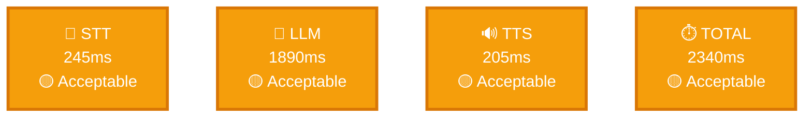

### System Resources

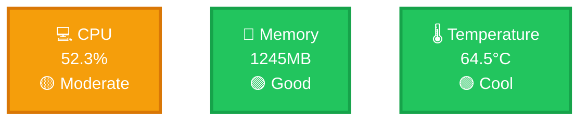

---

## ⏱️ Latency Performance Analysis

### Component Breakdown (Average)


### Performance vs Targets

```mermaid
%%{init: {'theme':'base'}}%%
xychart-beta
    title "Latency: Target vs Actual"
    x-axis [STT, LLM, TTS, Total]
    y-axis "Latency (ms)" 0 --> 3000
    bar "🎯 Target" [200, 1500, 150, 2000]
    bar "📊 Actual" [245, 1890, 205, 2340]
```

### Response Time Trends

#### 🎤 STT Latency Timeline

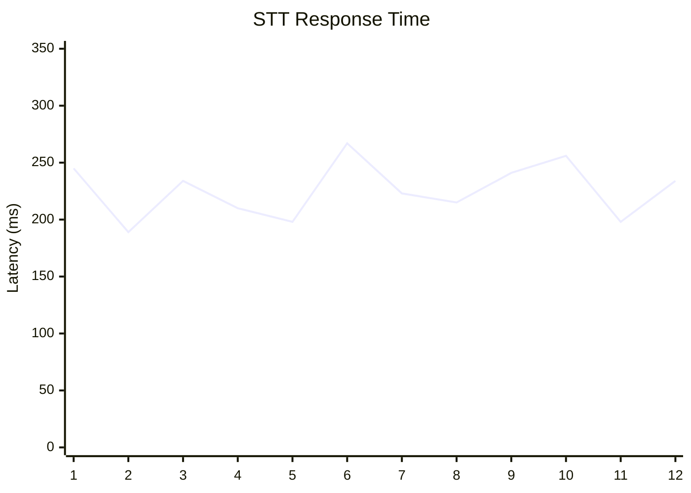

#### 🧠 LLM Latency Timeline

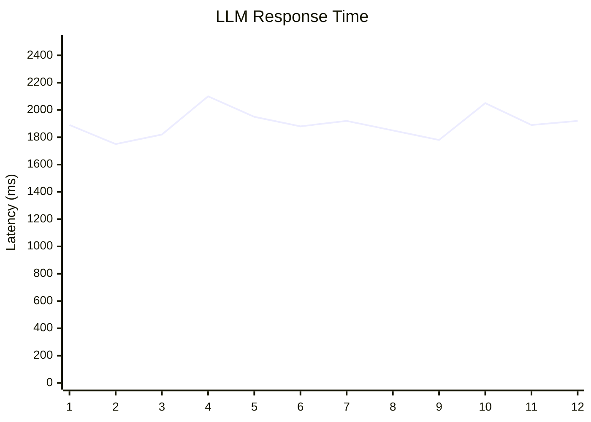

#### 🔊 TTS Latency Timeline

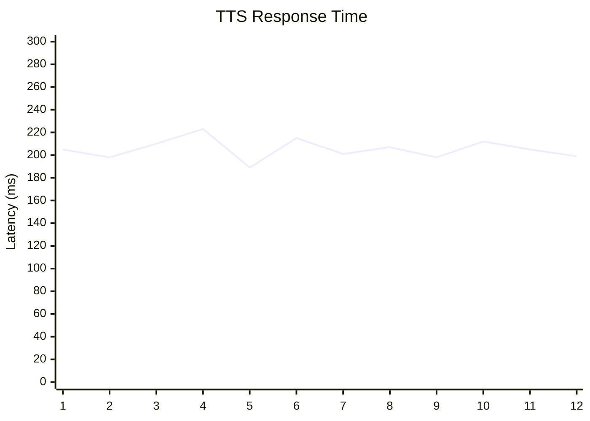

#### ⏱️ TOTAL Latency Timeline

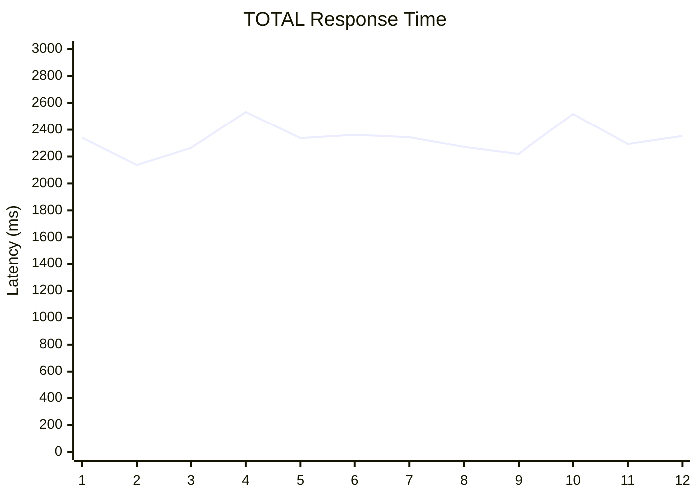

---

## 💻 System Resource Analysis

### System Health Overview


### CPU Usage Over Time

**Peak:** 60.1% | **Average:** 52.3%

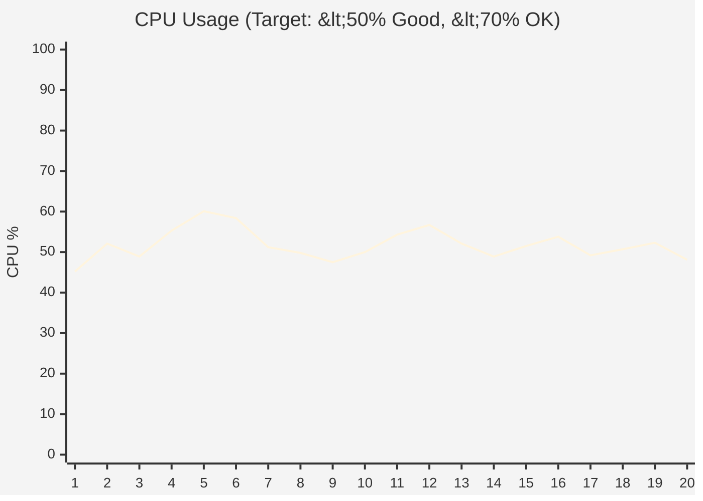

### Memory Usage Over Time

**Peak:** 1275MB | **Average:** 1245MB

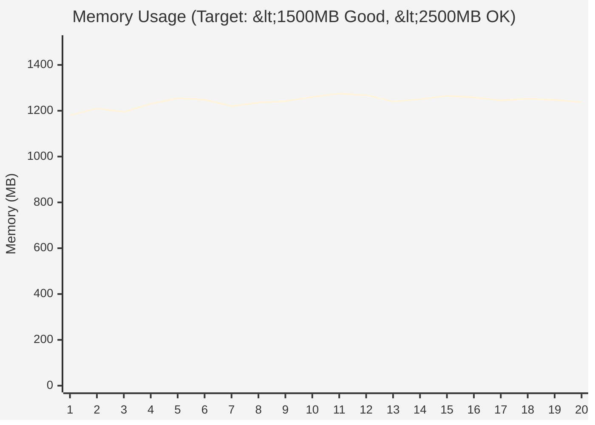

### CPU Temperature Over Time

**Peak:** 64.5°C | **Average:** 61.8°C

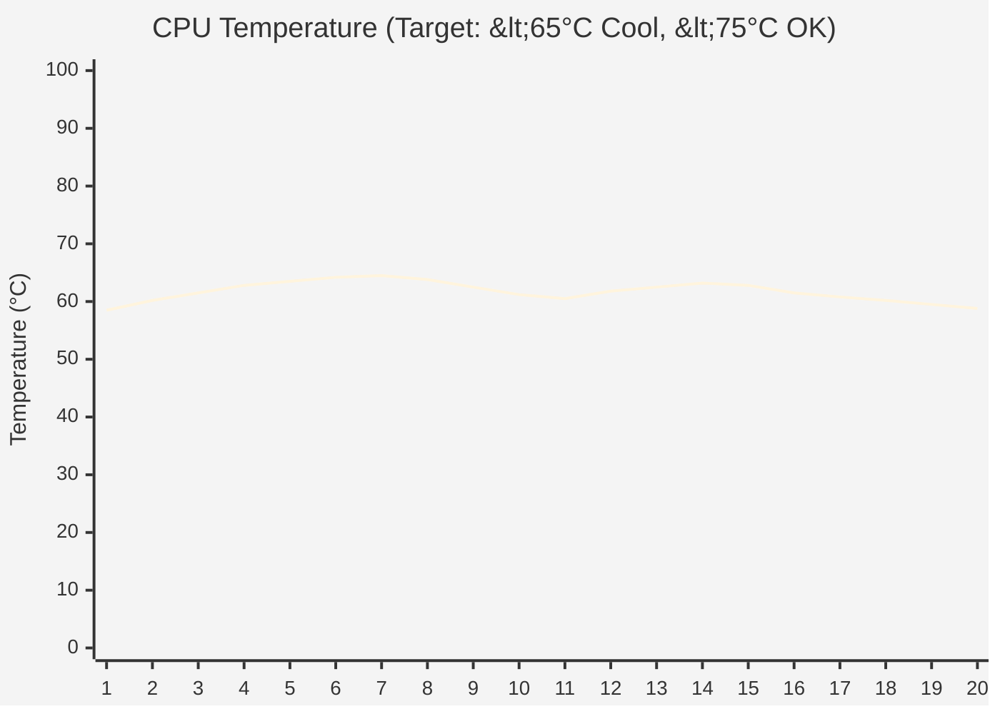

> 🟢 **INFO:** Temperature 64.5°C is within acceptable range
> - Normal operation, but cooling could improve longevity

---

## 📅 Conversation Timeline

```mermaid
%%{init: {'theme':'base'}}%%
gantt
    title Conversation Flow
    dateFormat X
    axisFormat %M:%S
    Conversation 1 :conv1, 0, 2500
    Conversation 2 :conv2, 5000, 7500
    Conversation 3 :conv3, 10000, 12500
    Conversation 4 :conv4, 15000, 17500
    Conversation 5 :conv5, 20000, 22500
    Conversation 6 :conv6, 25000, 27500
    Conversation 7 :conv7, 30000, 32500
    Conversation 8 :conv8, 35000, 37500
    Conversation 9 :conv9, 40000, 42500
    Conversation 10 :conv10, 45000, 47500
```

---

## 📈 Detailed Performance Metrics

### Latency Statistics (Min / Mean / Max)

**🎤 STT** (12 samples)

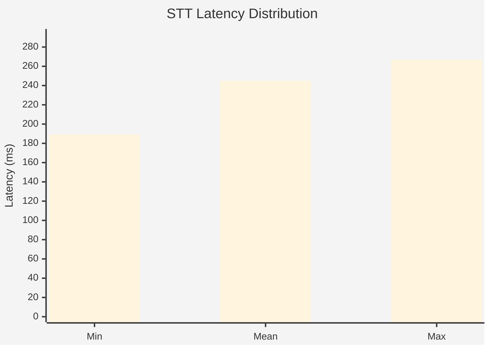

**🧠 LLM** (12 samples)

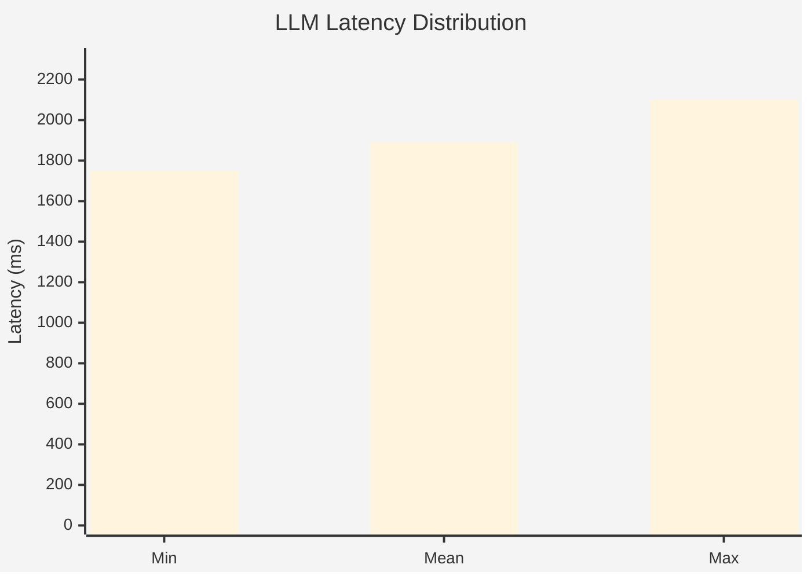

**🔊 TTS** (12 samples)

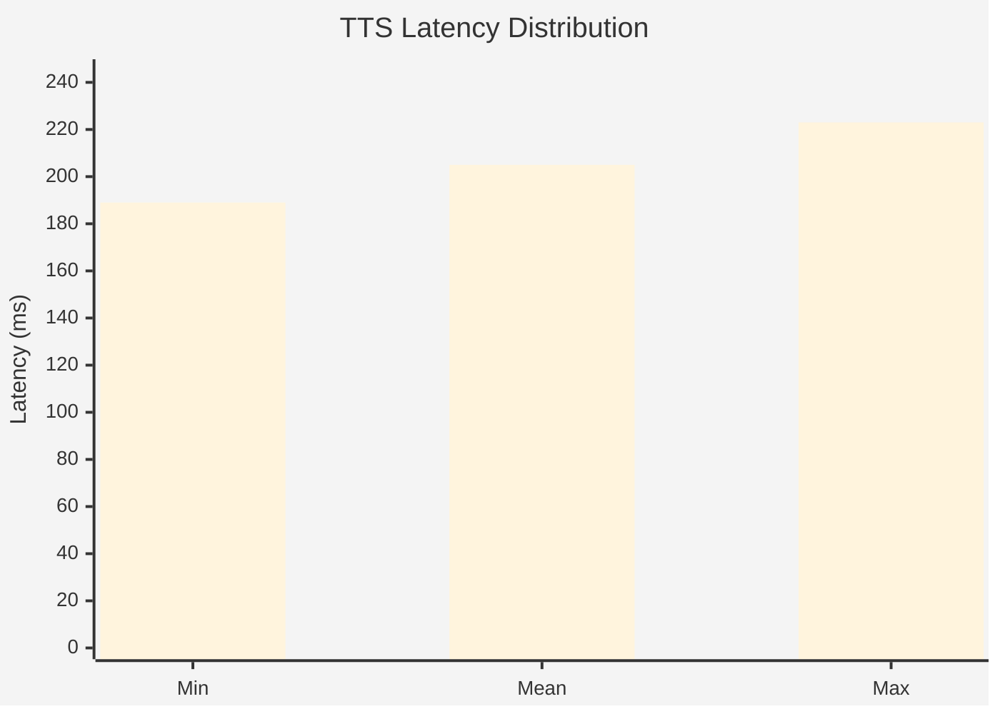

**⏱️ END-TO-END** (12 samples)

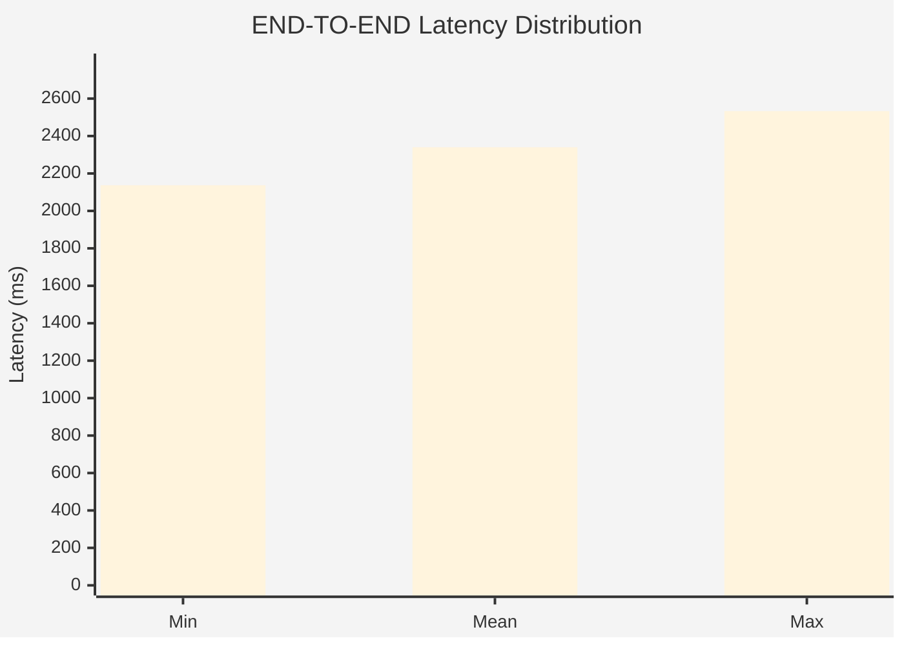

### System Resource Range

**💻 CPU Usage**

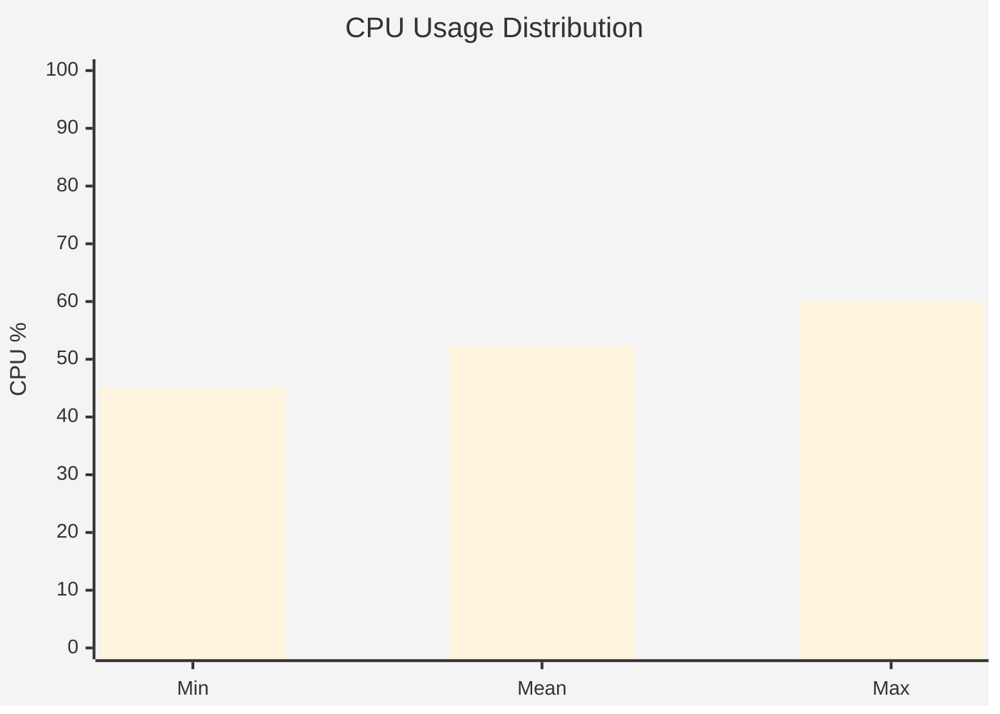

**🧠 Memory Usage**

```mermaid
%%{init: {'theme':'base'}}%%
xychart-beta
    title "Memory Usage Distribution"
    x-axis ["Min", "Mean", "Max"]
    y-axis "Memory (MB)" 0 --> 1530
    bar [1180, 1245, 1275]
```

**🌡️ CPU Temperature**

```mermaid
%%{init: {'theme':'base'}}%%
xychart-beta
    title "Temperature Distribution"
    x-axis ["Min", "Mean", "Max"]
    y-axis "Temperature (°C)" 0 --> 100
    bar [58.5, 61.8, 64.5]
```

---

## ✅ No Issues Detected

Session completed without errors or warnings.

---

## 💡 Recommendations

### Performance Improvements

🟡 **Latency:** Total response time could be improved (>2340ms)
   - LLM is the bottleneck - consider model optimization
   - Check system load during conversations
🟡 **STT Performance:** Speech recognition is slow (>245ms)
   - Whisper Tiny should be <250ms on RPi 4
   - Check CPU availability during STT processing
🟠 **LLM Performance:** Language model inference is slow (>1890ms)
   - This is expected on RPi 4 with Qwen2.5:0.5B
   - Consider: RPi 5, or cloud-based LLM (OpenAI API)
🟡 **CPU Usage:** CPU usage is high (52.3%)
   - Normal for active conversations, but monitor stability

---
