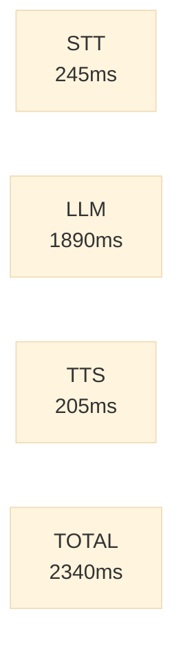
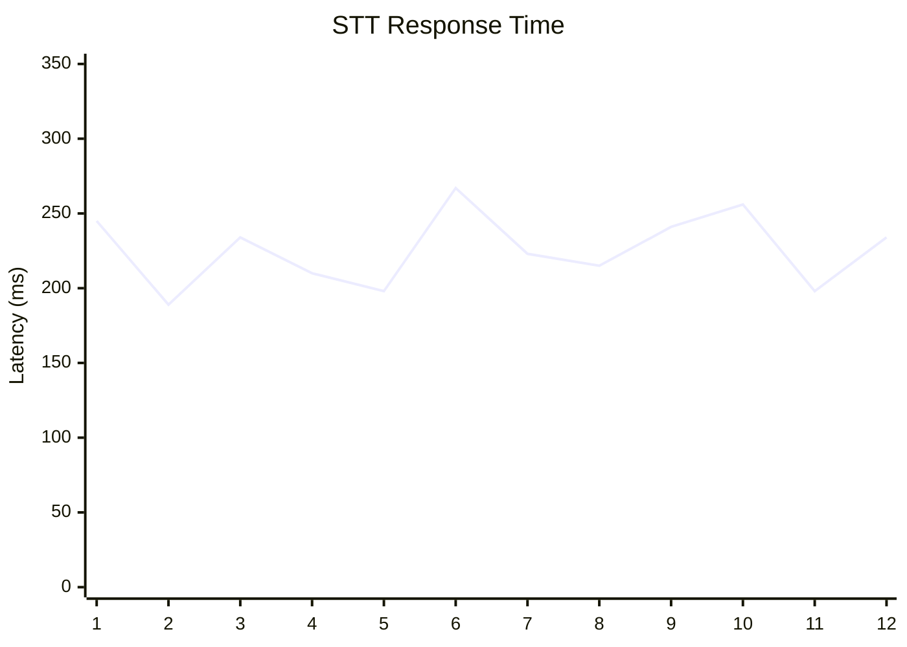
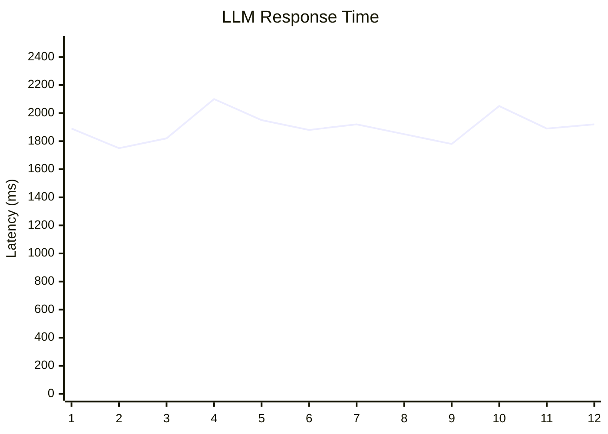
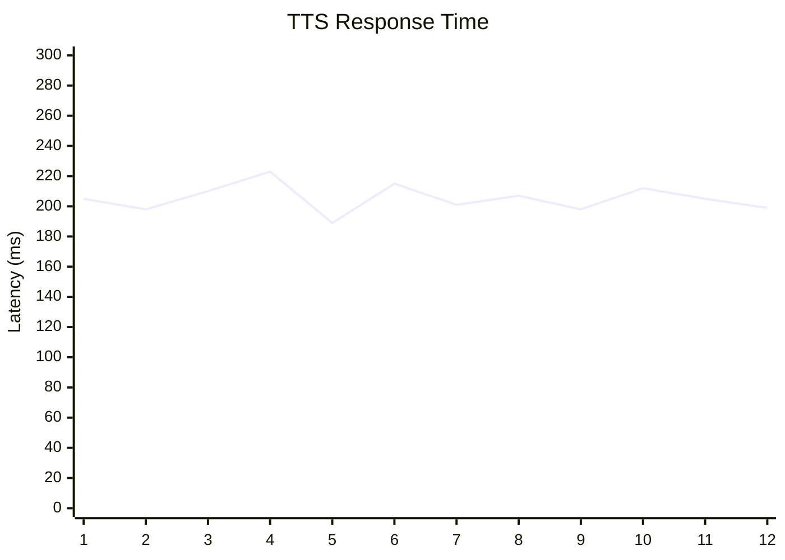
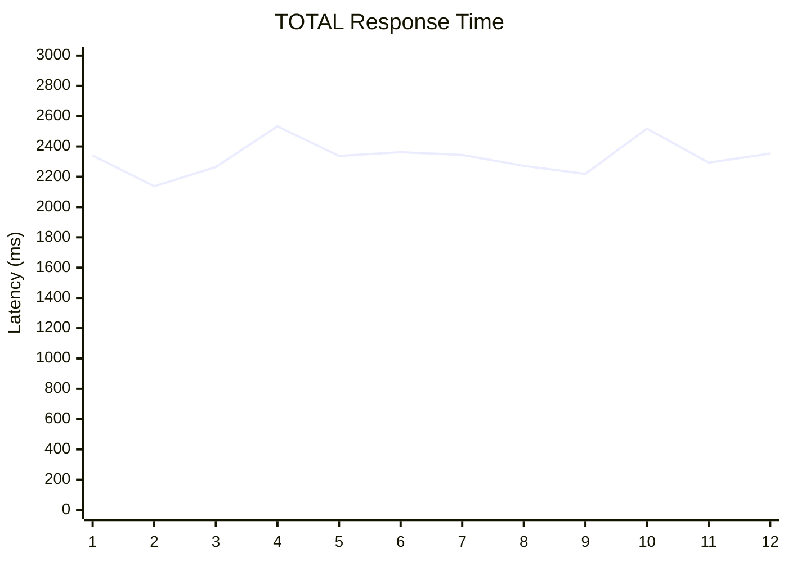
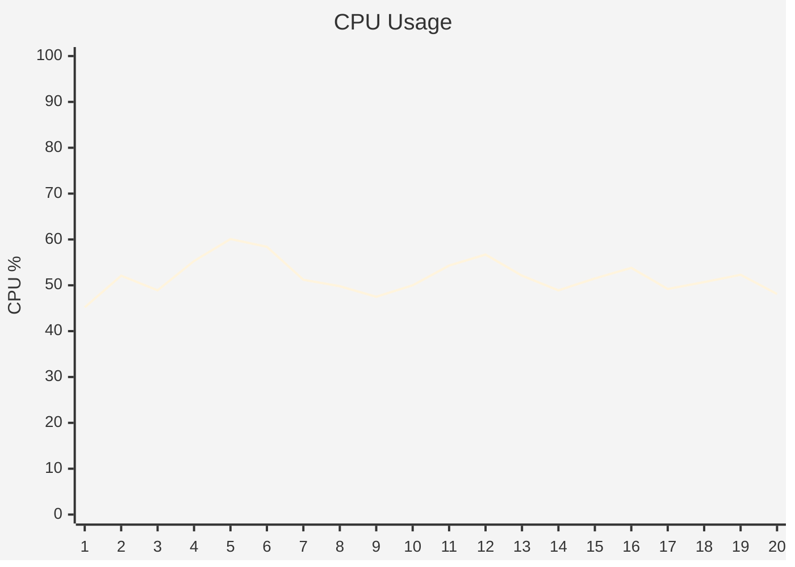
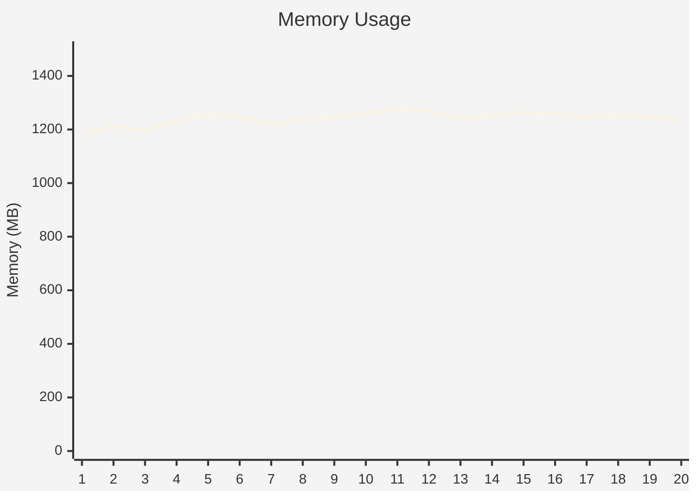
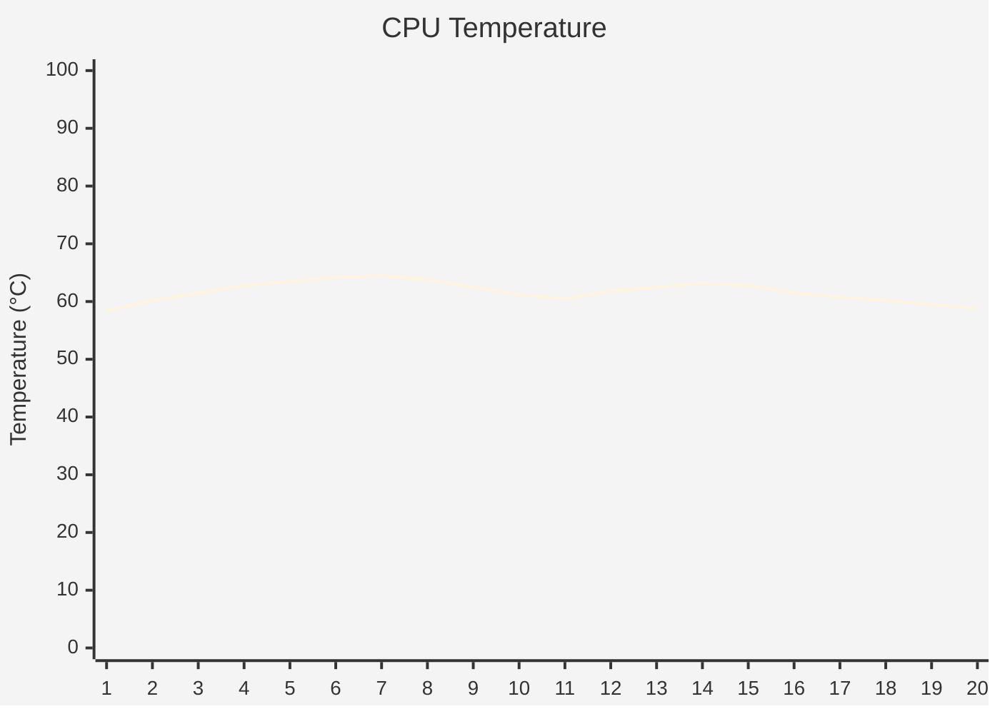

```mermaid
%%{init: {'theme':'base'}}%%
gantt
    title Conversation Flow
    dateFormat X
    axisFormat %M:%S
    Conversation 1 :conv1, 0, 2500
    Conversation 2 :conv2, 5000, 7500
    Conversation 3 :conv3, 10000, 12500
    Conversation 4 :conv4, 15000, 17500
    Conversation 5 :conv5, 20000, 22500
    Conversation 6 :conv6, 25000, 27500
    Conversation 7 :conv7, 30000, 32500
    Conversation 8 :conv8, 35000, 37500
    Conversation 9 :conv9, 40000, 42500
    Conversation 10 :conv10, 45000, 47500
```

# 🪐 Pluto Performance Report

**Session ID:** `20251018_143022`

**Start Time:** 2025-10-18 14:30:22

**Duration:** 5m 42s

---

## 📊 Executive Summary

| Metric | Value |
|--------|-------|
| **Conversations** | 12 |
| **Errors** | 0 |
| **Warnings** | 0 |
| **Avg End-to-End Latency** | 2340ms |
| **Avg STT Latency** | 245ms |
| **Avg LLM Latency** | 1890ms |
| **Avg TTS Latency** | 205ms |
| **Avg CPU Usage** | 52.3% |
| **Avg Memory Usage** | 1245MB |
| **Peak Temperature** | 64.5°C |

---

## ⏱️ Latency Performance

### Component Latency Comparison

### Latency Over Time

#### STT Latency Timeline

#### LLM Latency Timeline

#### TTS Latency Timeline

#### TOTAL Latency Timeline

---

## 💻 System Resources

### CPU Usage Over Time

### Memory Usage Over Time

### CPU Temperature Over Time

---

## 📅 Conversation Timeline

---

## 📈 Detailed Statistics

### Latency Breakdown

| Component | Count | Min | Max | Mean | Median | P95 |
|-----------|-------|-----|-----|------|--------|-----|
| **STT** | 12 | 189ms | 267ms | 245ms | 234ms | 262ms |
| **LLM** | 12 | 1750ms | 2100ms | 1890ms | 1890ms | 2065ms |
| **TTS** | 12 | 189ms | 223ms | 205ms | 205ms | 218ms |
| **TOTAL** | 12 | 2137ms | 2533ms | 2340ms | 2344ms | 2511ms |

### System Resource Statistics

| Resource | Min | Max | Mean |
|----------|-----|-----|------|
| **CPU Usage** | 45.2% | 60.1% | 52.3% |
| **Memory Usage** | 1180MB | 1275MB | 1245MB |
| **CPU Temperature** | 58.5°C | 64.5°C | 61.8°C |

---

## ✅ No Issues Detected

Session completed without errors or warnings.

---
